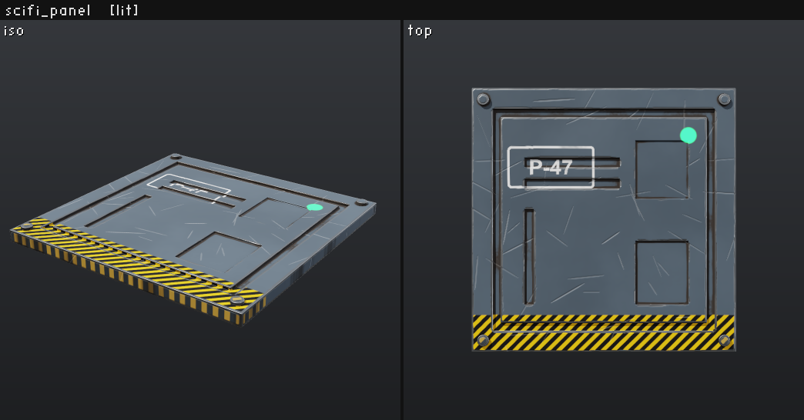
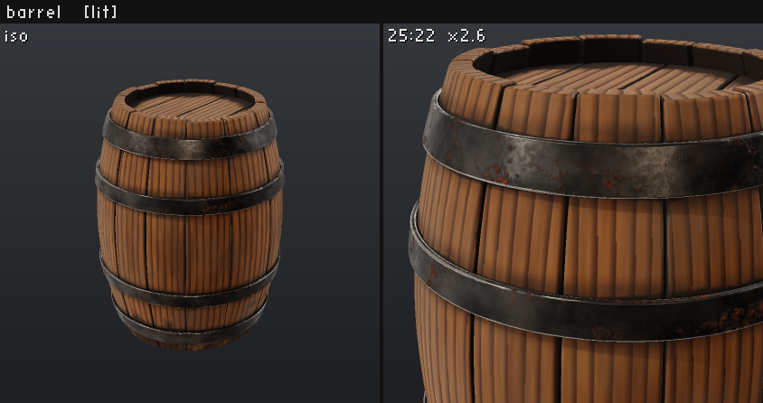
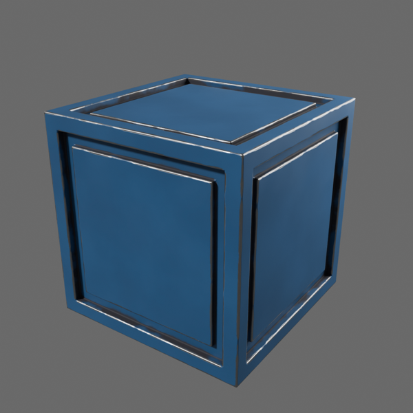
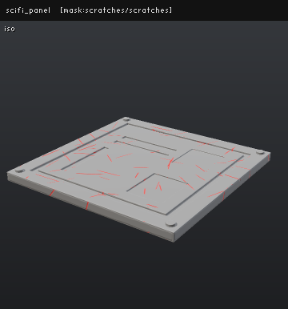
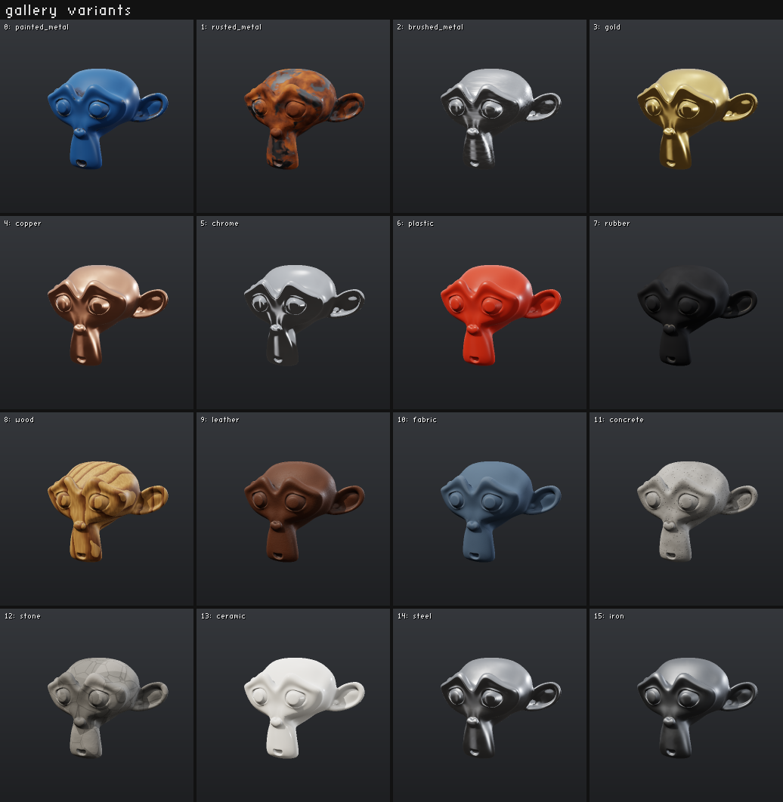
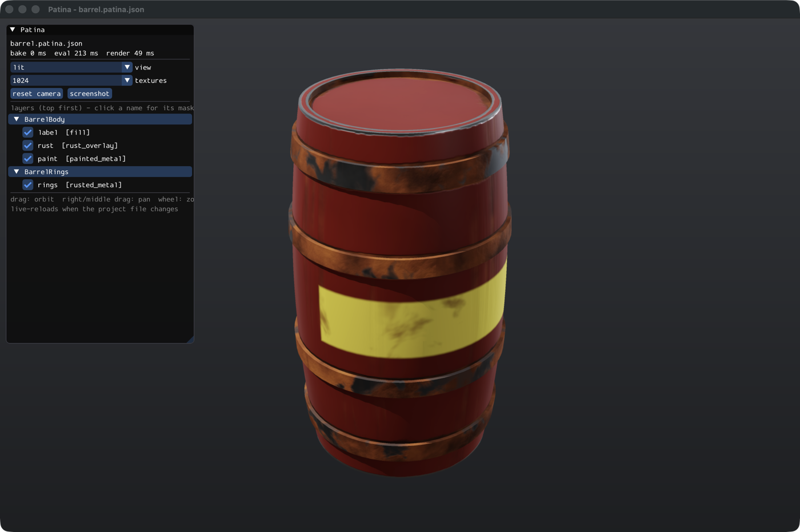

# Patina

**A headless, agent-first texturing engine: Substance Painter for AI agents.**

Patina textures 3D assets (from Blender, or anything that exports glTF/OBJ) with Substance-style
layer stacks:

- fill layers, folders and smart materials
- mask stacks of generators: edge wear, dirt, curvature, AO, gradients, 3D noise, grunge, scratches, streaks
- 3D paint strokes and projected decals

It ships as one native C++ binary for **macOS and Windows** with a **CLI**, an **MCP server** and a
**native viewer**. There is no GUI to drive, no web stack and no GPU requirement.



## Why

Substance Painter is built for people with a mouse. Agents need:

| Agents need | Patina |
|---|---|
| A way to express intent | A **declarative project file**: every layer, mask and parameter is JSON an agent can read, diff and patch. |
| Eyes | A **built-in renderer** that returns images the agent can look at: lit PBR, clay, per-channel, and "where does this layer apply" mask views. About 100 ms per preview. |
| Reproducibility | **Deterministic output**: the same project gives bit-identical textures every time. |
| Scale | **Parallelism everywhere**: baking, evaluation, rendering and PNG encoding use every core, MCP tool calls run concurrently, and `batch`/`variants` fan out across assets and alternatives. |
| No UV seams | **3D procedural noise evaluated at the surface position**, so noise is seamless across seams. |
| Normal maps without the fuss | A **high-to-low normal baker** with automatic cage, automatic anti-skew and `_low`/`_high` name matching (no bleed between parts), plus a **bevel shader** that bakes rounded edges from the low poly alone. MikkTSpace throughout. |
| Engine-ready output | Export presets for Blender, glTF (ORM), Unreal, Unity HDRP/URP and Godot, plus a textured `.glb` and a Blender bridge that builds the materials. |

<p>



</p>

*Left: three texture sets on one mesh (oak staves and heads with UV-space grain along every board, forged iron
hoops with rust), lit by the built-in studio HDRI. Middle: Patina's
export rendered in Blender Cycles through the bridge. Right: `mode=mask:<layer>` shows exactly where a layer applies.*



*One `variants` call renders 16 smart materials side by side, evaluated in parallel in 0.7 s.*

## Performance

Measured on an M5 Pro (6P + 12E cores) at 2048² per texture set:

| Asset | Tris | Cold bake (AO, thickness, curvature) | Layer eval | 4-view preview | Full export |
|-------|------|--------------------------------------|------------|----------------|-------------|
| Suzanne | 15.7k | 0.86 s | 0.15 s | 22 ms | 0.27 s |
| Barrel, previous 6k-tri asset (2 texture sets) | 6k | 1.25 s | 0.8 s | 45 ms | ~2 s |

- Previews evaluate at 1024² by default: about 0.1–0.4 s per edit-render loop.
- Bakes are cached in memory and on disk (`.patina/`).
- A 5-asset cold `batch` export at 2K finishes in about 6 s of wall time.

## Install

One command installs the latest release. It sets up the binary in `~/.patina/bin` (added to your PATH), the
`patina` skill for Claude Code in `~/.claude/skills/patina`, and the MCP server for every project.

```bash
curl -fsSL https://raw.githubusercontent.com/parodyband/patina/main/install.sh | sh      # macOS (Apple silicon)
```

```powershell
irm https://raw.githubusercontent.com/parodyband/patina/main/install.ps1 | iex           # Windows
```

**Updating.** `patina update` downloads the newest release, checks it against the release's SHA-256 sums and
reinstalls, which also refreshes the skill and guide. Patina never updates itself: the MCP server checks for a
new release at most once a day and tells the agent (and `patina version` tells you) when one is out. Set
`PATINA_NO_UPDATE_CHECK=1` to turn the check off.

From a source build, `build/patina install` does the same setup with your own binary. Flags: `--no-skill`,
`--no-mcp`, `--no-path`.

**Releasing.** Bump `VERSION` in `CMakeLists.txt`, then push a matching tag (`git tag v0.3.0 && git push --tags`).
CI builds and tests both platforms and publishes the binaries with `SHA256SUMS.txt` as a GitHub release.

## Build

You need CMake ≥ 3.20 and a C++20 compiler: Xcode clang on macOS, or MSVC 2022 on Windows. There is no
package manager; all dependencies are vendored single headers (cgltf, stb, sokol, Dear ImGui).

```bash
cmake -S . -B build -G Ninja -DCMAKE_BUILD_TYPE=Release
cmake --build build          # ~5 s clean build on 18 cores
bash tests/run_tests.sh      # end-to-end suite (~3 s)
```

On Windows, run these from a "x64 Native Tools Command Prompt for VS 2022" (or a Developer PowerShell
with `-arch=x64`) so `cl` is on the path, and run the tests from Git Bash. The binary is `build\patina.exe`.

CI builds and tests on macOS (clang) and Windows (MSVC) on every push.

## Use it from an agent (MCP)

`patina install` registers the server for all projects. To register it by hand:

```bash
claude mcp add --scope user patina -- /path/to/patina mcp
```

This repo also ships a `.mcp.json` that points at your dev build (`build/patina`); inside the repo it takes
precedence over the installed one. On Windows the build moves a running `patina.exe` aside before linking, so
you can rebuild while Claude Code has the dev server open.

**Tools**

| Tool | What it does |
|---|---|
| `inspect` | describe a mesh |
| `new_project` | create a project |
| `get_project` | read a project |
| `edit` | apply edit operations |
| `render` | render a preview (returns an image) |
| `variants` | compare alternatives side by side |
| `bake` | bake mesh maps |
| `export` | write textures |
| `library` | list materials, fields and presets, or read the guide with `topic="guide"` |
| `validate` | check a project |
| `batch` | run many commands at once |
| `blender` | drive Blender headless |

The server tells agents to read `library(topic="guide")`, i.e. [docs/AGENT_GUIDE.md](docs/AGENT_GUIDE.md), which is embedded in the binary.

## Use it from the CLI

Every command prints JSON.

```bash
patina inspect examples/assets/crate.glb
patina new work/crate.patina.json --mesh examples/assets/crate.glb --smart painted_metal
patina edit work/crate.patina.json '[{"op":"add","layer":{"id":"dust","type":"smart","material":"dust_overlay"}}]'
patina render work/crate.patina.json --views iso,front --mode lit      # -> work/renders/crate.png
patina render work/crate.patina.json --mode mask:dust                   # where does the dust go?
patina export work/crate.patina.json --preset unreal --glb
patina batch --do export a.patina.json b.patina.json c.patina.json -j 8
patina blender apply --project work/crate.patina.json --out crate.blend --render crate.png
patina view work/crate.patina.json                                      # native viewer
patina guide                                                            # the agent guide
```

## Viewer

`patina view <project>` opens a native window: Metal on macOS, D3D11 on Windows.

- It uses the same renderer agents see.
- It live-reloads whenever an agent edits the project, so a human can watch agents work.
- Controls: orbit, pan and zoom; switch channels and bake views.
- Click a layer to see its mask, or toggle layers on and off (viewer-only; nothing is written).



## A project file

```json
{
  "patina": 1,
  "mesh": "../assets/panel.glb",
  "resolution": 2048,
  "texture_sets": {
    "Panel": {"layers": [
      {"id": "base", "type": "smart", "material": "painted_metal", "params": {"color": "#56616b", "wear": 0.45}},
      {"id": "stencil", "type": "decal", "image": "../images/stencil_p47.png", "position": [0.3, 1, 0.3], "facing": "up", "size": 0.34},
      {"id": "scratches", "type": "smart", "material": "scratches_overlay", "params": {"amount": 0.35}},
      {"id": "light", "channels": {"emissive": {"color": "#27e36b", "intensity": 3}},
       "mask": [{"type": "sphere", "center": [0.82, 1, 0.18], "radius": 0.035}]}
    ]}
  }
}
```

## Layout

| Path | What it holds |
|---|---|
| `src/mesh.*` | glTF/GLB/OBJ loading, tangents, UV islands, inspection |
| `src/bvh.*` | SAH BVH with early split clipping |
| `src/bake.*` | UV rasterization with gutter samples, AO and thickness (ray traced on a subsampled lattice), edge-integral curvature, padding, disk cache |
| `src/eval.*` | fields, generators, mask stacks, blend modes, height→normal |
| `src/library.cpp` | smart materials (parameterized templates) and export presets |
| `src/render.*` | tiled CPU PBR rasterizer and contact sheets |
| `src/export.*` | channel packing, manifest, textured GLB |
| `src/commands.*` | command implementations shared by the CLI and MCP; session caches |
| `src/mcp.cpp` | MCP server (stdio JSON-RPC, concurrent tool calls) |
| `src/update.cpp` | `install` / `update`: installed binary, Claude Code skill, MCP registration, verified self-update |
| `src/viewer.cpp` | sokol + Dear ImGui viewer |
| `tools/blender/` | Blender bridge (`export` .blend→.glb, `apply` manifest→Principled BSDF) |
| `examples/` | test assets (generated by `examples/make_assets.py` in Blender) and showcase projects |
| `docs/` | agent guide, research notes |

See [docs/RESEARCH.md](docs/RESEARCH.md) for how Patina relates to Substance Painter, ArmorPaint and AI texture generators.
